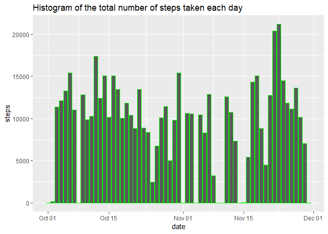

1. Code for reading in the dataset and/or processing the data

```r
data<-read.csv("activity.csv")
```

Here is the first 5 rows of data

```r
head(data)
```

```
##   steps       date interval
## 1    NA 2012-10-01        0
## 2    NA 2012-10-01        5
## 3    NA 2012-10-01       10
## 4    NA 2012-10-01       15
## 5    NA 2012-10-01       20
## 6    NA 2012-10-01       25
```

2. Histogram of the total number of steps taken each day


```r
Sys.setlocale("LC_TIME", "C")
```

```
## [1] "C"
```

```r
library(dplyr)
```

```
## 
## Attaching package: 'dplyr'
```

```
## The following objects are masked from 'package:stats':
## 
##     filter, lag
```

```
## The following objects are masked from 'package:base':
## 
##     intersect, setdiff, setequal, union
```

```r
library(ggplot2)
data$date<- as.Date(data$date)
bin<-list()
for (i in unique(data$date)){
  if(i==unique(data$date)[1]){k<-1}
  cal<-subset(data,date==i)
  summation<-data.frame(sum(cal$steps,na.rm = TRUE))
  summation$date<-as.Date(i,origin="1970-01-01")
  bin[[k]]<-summation
  k<-k+1
}
dataComplete <-bind_rows(bin)
colnames(dataComplete)<-c("steps","date")

ggplot(dataComplete,aes(x=date,y=steps))+geom_histogram(stat = "identity",color="green")+ggtitle("Histogram of the total number of steps taken each day")
```

```
## Warning: Ignoring unknown parameters: binwidth, bins, pad
```

<!-- -->

3. Mean and median number of steps taken each day


```r
bin<-list()
for (i in unique(data$date)){
  if(i==unique(data$date)[1]){k<-1}
  cal<-subset(data,date==i)
  dataNew<-data.frame(mean(cal$steps,na.rm=TRUE))
  dataNew$median<-median(cal$steps,na.rm=TRUE)
  dataNew$date<-as.Date(i,origin="1970-01-01")
  bin[[k]]<-dataNew
  k<-k+1
  }
dataComplete3 <-bind_rows(bin)
colnames(dataComplete3)<-c("mean","median","date")
```

Here is the first 5 rows of mean and median number of steps taken each day


```r
head(dataComplete3)
```

```
##       mean median       date
## 1      NaN     NA 2012-10-01
## 2  0.43750      0 2012-10-02
## 3 39.41667      0 2012-10-03
## 4 42.06944      0 2012-10-04
## 5 46.15972      0 2012-10-05
## 6 53.54167      0 2012-10-06
```

4. Time series plot of the average number of steps taken


```r
library(data.table)
```

```
## 
## Attaching package: 'data.table'
```

```
## The following objects are masked from 'package:dplyr':
## 
##     between, first, last
```

```r
library(lubridate)
```

```
## 
## Attaching package: 'lubridate'
```

```
## The following objects are masked from 'package:data.table':
## 
##     hour, isoweek, mday, minute, month, quarter, second, wday,
##     week, yday, year
```

```
## The following object is masked from 'package:base':
## 
##     date
```

```r
dataNew4<-dcast(data,interval~date,value.var="steps")
dataNew4$mean<-rowMeans(dataNew4[,2:ncol(dataNew4)],na.rm = TRUE)
dataNew4$intervalNew <- sprintf("%04d",dataNew4$interval)
dataNew4$intervalNew <- strptime(dataNew4$intervalNew, format="%H%M")

plot(x=dataNew4$intervalNew,y=dataNew4$mean,type="l",
     main="Time series plot of the average number of steps taken",
     xlab="time",ylab="steps",col="blue",lwd=2)
```

<!-- -->

5. The 5-minute interval that, on average, contains the maximum number of steps


```r
maxInterval<-dataNew4$intervalNew[which.max(dataNew4$mean)]
maxInterval<-parse_date_time(maxInterval,order="YmdHMS")
paste0(hour(maxInterval),":",minute(maxInterval))
```

```
## [1] "8:35"
```

6. Code to describe and show a strategy for imputing missing data

First, let's look at how many NA data is by calculating the average
NA data of all columns.


```r
paste("percentage of NA data in step column is",mean(is.na(data$steps))*100,"%")
```

```
## [1] "percentage of NA data in step column is 13.1147540983607 %"
```

```r
paste("percentage of NA data in interval column is",mean(is.na(data$interval))*100,"%")
```

```
## [1] "percentage of NA data in interval column is 0 %"
```

```r
paste("percentage of NA data in date column is",mean(is.na(data$date))*100,"%")
```

```
## [1] "percentage of NA data in date column is 0 %"
```

It can be seen that there is no missing data in interval and date cloumns. However, there are 13.11% of missing values in step column which can be considered as significant.

Therefore, the best solution is to replace NA values in steps column with the mean of steps in each day (exclude NA value in calculation). However, when investigeting in the result, it


```r
dataNew6<-dcast(data,date~interval,value.var="steps")
dataNew6$mean<-rowMeans(dataNew6[,2:ncol(dataNew6)],na.rm = TRUE)
```
However, when investigeting in the result, it is seen that there are days that all the values of step is NA, Hence, alternative solution is to use the means of step in each 5-minutes interval that already calculated in problem 4. instead.


```r
dataImputed<-data
for (i in unique(data$interval)){
  dataImputed$steps[dataImputed$interval==i&is.na(dataImputed$step)]<-dataNew4$mean[dataNew4$interval==i]
}
```
Here is the first 5 rows of imputed data

```r
head(dataImputed)
```

```
##       steps       date interval
## 1 1.7169811 2012-10-01        0
## 2 0.3396226 2012-10-01        5
## 3 0.1320755 2012-10-01       10
## 4 0.1509434 2012-10-01       15
## 5 0.0754717 2012-10-01       20
## 6 2.0943396 2012-10-01       25
```
7. Histogram of the total number of steps taken each day after missing values are imputed

Calculate the sum of steps taken each day from dataImputed.


```r
dataNew7<-dcast(dataImputed,date~interval,value.var="steps")
dataNew7$total<-rowSums(dataNew7[,2:ncol(dataNew7)])
```

plot the histogram with ggplot2


```r
ggplot(dataNew7,aes(x=date,y=total))+geom_histogram(stat = "identity",color="green")+ggtitle("Histogram of the total number of steps taken each day after missing \n values are imputed")
```

```
## Warning: Ignoring unknown parameters: binwidth, bins, pad
```

<!-- -->

8. Panel plot comparing the average number of steps taken per 5-minute interval across weekdays and weekends

Split days of the week into weekday and weekend, and then use "weekdays" function to match the day

```r
weekDay<-c("Monday","Tuesday","Wednesday","Thursday","Friday")
weekEnd<-c("Saturday","Sunday")
dataImputed$dayOfWeek[weekdays(dataImputed$date) %in% weekDay]<-"weekday"
dataImputed$dayOfWeek[weekdays(dataImputed$date) %in% weekEnd]<-"weekend"
dataNew8<-dcast(dataImputed,interval~dayOfWeek,mean,value.var = "steps")
dataNew8$intervalNew <- sprintf("%04d",dataNew8$interval)
dataNew8$intervalNew <- strptime(dataNew8$intervalNew, format="%H%M")
```
plot the result with base plot


```r
par(mfrow = c(2, 1))
plot(x=dataNew8$intervalNew,y=dataNew8$weekday,type="l",
     main="weekday",
     xlab="time",ylab="steps",col="blue",lwd=2)
plot(x=dataNew8$intervalNew,y=dataNew8$weekend,type="l",col="red",lwd=2,
     main="weekend",xlab="time",ylab="steps")
```

<!-- -->
